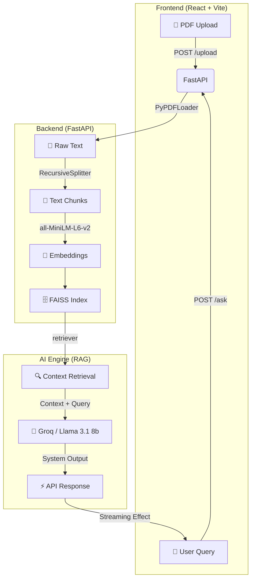

# AskMyDocs (RAG PDF Explorer)

AskMyDocs is a high-performance Retrieval-Augmented Generation (RAG) system built for searching and analyzing PDF documents through a natural chat interface. It leverages **Groq (Llama 3.1 8b)** for low-latency inference and **HuggingFace Embeddings** for local vector search.

## ✨ Key Features

- **High-Speed RAG**: Sub-second responses using Groq's LPUs and Llama-3.1-8b-instant.
- **Smart Retrieval**: Uses MMR (Maximum Marginal Relevance) for diverse context retrieval.
- **Persistent Memory**: Context-aware chat sessions that remember previous document insights.
- **Modern Interface**: Clean, distraction-free React UI with simulated streaming for better UX.
- **Scalable Backend**: FastAPI-powered microservice with optimized embedding globalization.

## 📋 System Requirements

- **Python**: 3.10 or higher.
- **Node.js**: 18.x or higher.
- **Environment**: Groq API Key required.

## 🚀 Getting Started

### 1. Configuration

Create a `.env` file in the `backend/` directory:

```ini
GROQ_API_KEY=your_groq_api_key_here
```

### 2. Backend Setup

```bash
cd backend
python -m venv venv
source venv/bin/activate  # On Windows: venv\Scripts\activate
pip install -r requirements.txt
uvicorn main:app --host 0.0.0.0 --port 8000 --reload
```

### 3. Frontend Setup

```bash
cd frontend
npm install
npm run dev
```

## 🔄 Project Architecture



## 📂 Project Structure

- `backend/main.py`: Entry point for the FastAPI server.
- `backend/rag/vectorstore.py`: Core RAG logic (Chunking, Embeddings, FAISS).
- `backend/routers/chat.py`: API endpoint handlers for upload and chat.
- `frontend/src/App.jsx`: Main React application logic.
- `frontend/src/App.css`: Custom UI styles and branding.
- `render.yaml`: Blueprint for cloud deployment on Render.com.
